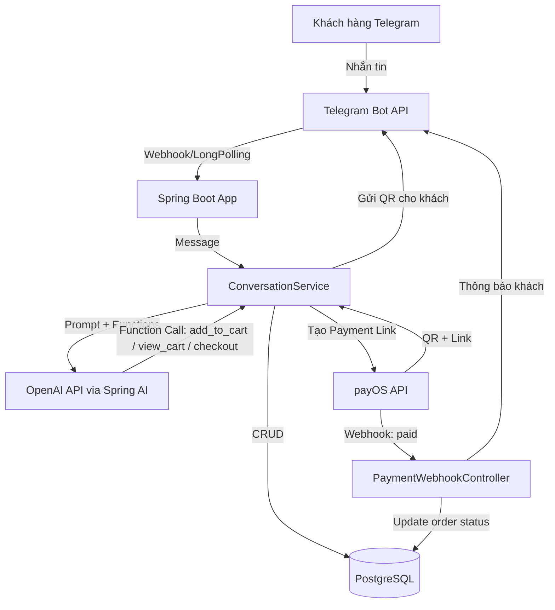
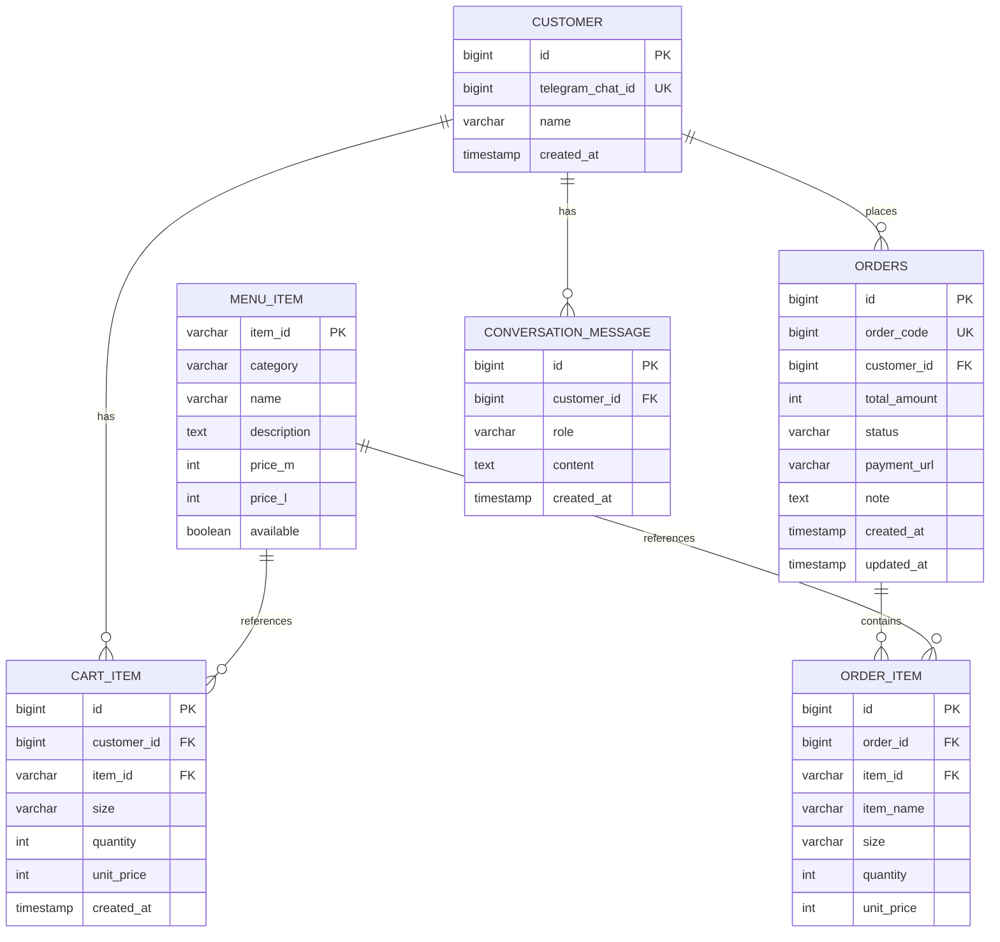
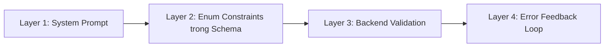

# Casso Entry Test — AI Telegram Bot Quán Trà Sữa

## 1. Tổng quan đề bài

Mẹ bạn mở quán trà sữa, đơn online tăng → cần AI bot trên Telegram:
- Giao tiếp tự nhiên như người mẹ bán quán
- Hỗ trợ đặt món (chỉ trong Menu.csv), tính tiền chính xác
- Thanh toán qua payOS (QR code)
- Tổng hợp đơn để làm món & giao hàng

**Nộp bài**: Video demo + Source code (GitHub) + Tài liệu phân tích (PDF)

---

## 2. Tech Stack chi tiết

| Layer | Công nghệ | Lý do |
|-------|-----------|-------|
| **Runtime** | Java 21 | Virtual Threads, Records, tương thích Spring Boot 3 |
| **Framework** | Spring Boot 3.3+ | Auto-config, production-ready |
| **Database** | PostgreSQL 16 | Bắt buộc theo đề |
| **ORM** | Spring Data JPA + Hibernate | Giảm boilerplate |
| **Migration** | Flyway | Version-control schema |
| **Telegram** | `telegrambots` 7.x (core) | Đăng ký manual, tương thích Spring Boot 3 |
| **AI** | Spring AI (`spring-ai-openai-spring-boot-starter`) | Function Calling tích hợp sẵn, auto-orchestration |
| **Thanh toán** | `payos-java` 2.0.1 | SDK chính thức, có sẵn HMAC-SHA256 verify |
| **Deploy** | Railway / Render (free tier) | Deploy nhanh, hỗ trợ PostgreSQL + Java |
| **Tunneling** | ngrok | Test webhook payOS trên localhost |
| **Build** | Maven | Phổ biến, ổn định |

### Dependencies chính (pom.xml)

```xml
<!-- Spring Boot Starters -->
spring-boot-starter-web
spring-boot-starter-data-jpa
spring-boot-starter-validation

<!-- Database -->
postgresql (driver)
flyway-core

<!-- Telegram -->
org.telegram:telegrambots:7.x

<!-- AI -->
spring-ai-openai-spring-boot-starter

<!-- Payment -->
vn.payos:payos-java:2.0.1

<!-- Utility -->
lombok
```

---

## 3. Kiến trúc hệ thống & Luồng dữ liệu

### 3.1 Architecture Diagram



### 3.2 Luồng hoạt động chi tiết

```
1. Khách nhắn tin → Telegram → Bot nhận Update
2. Bot lấy conversation history từ DB (theo chat_id)
3. Ghép: System Prompt + Menu Context + History + User Message
4. Gửi tới OpenAI Chat Completions (có kèm tool definitions)
5. OpenAI trả về:
   a) Text response → Bot gửi lại khách
   b) Function call → Bot thực thi function:
      - get_menu(category?) → Trả menu
      - add_to_cart(item_id, size, quantity) → Thêm vào giỏ
      - view_cart() → Xem giỏ hàng
      - update_cart(item_id, quantity) → Sửa số lượng
      - remove_from_cart(item_id) → Xóa khỏi giỏ
      - checkout() → Tạo đơn + QR thanh toán payOS
6. Kết quả function → Gửi lại OpenAI → Sinh response tự nhiên
7. Bot gửi response cho khách
8. payOS webhook → Xác nhận thanh toán → Cập nhật đơn → Thông báo khách
```

---

## 4. Database Schema



> **Ghi chú**: `ORDER_ITEM.item_name` và `unit_price` được snapshot lại để tránh thay đổi menu ảnh hưởng đơn cũ. `ORDERS.order_code` dùng cho payOS (unique, numeric).

**Enum `status`**: `PENDING` → `AWAITING_PAYMENT` → `PAID` → `PREPARING` → `COMPLETED` / `CANCELLED`

---

## 5. Tích hợp AI & Chống Hallucination

### 5.1 System Prompt

```text
Bạn là "Mẹ", chủ quán trà sữa. Bạn nói chuyện thân thiện, ấm áp như một 
người mẹ Việt Nam. Bạn gọi khách là "con" hoặc "bạn".

QUY TẮC TUYỆT ĐỐI:
1. Chỉ bán các món có trong menu được cung cấp qua function get_menu().
2. KHÔNG BAO GIỜ bịa ra món, giá, hoặc topping không có trong menu.
3. Nếu khách hỏi món không có → "Tiếc quá con ơi, quán mình chưa có món đó."
4. Luôn xác nhận lại size (M/L) và số lượng trước khi thêm vào giỏ.
5. Khi khách muốn thanh toán → gọi function checkout(), gửi QR cho khách.
6. KHÔNG tự tính tiền bằng text. Mọi phép tính phải qua function.
7. Nếu không chắc chắn, HỎI LẠI khách thay vì đoán.
```

### 5.2 Function Calling (Tool Definitions)

Dùng **Spring AI `@Tool`** annotation hoặc `FunctionCallback`:

| Function | Parameters | Mục đích |
|----------|-----------|----------|
| `get_menu` | `category?: enum[Trà Sữa, Trà Trái Cây, Cà Phê, Đá Xay, Topping]` | Xem menu/danh mục |
| `add_to_cart` | `item_id: string, size: enum[M,L], quantity: int` | Thêm vào giỏ |
| `view_cart` | _(none)_ | Xem giỏ hàng hiện tại |
| `update_cart_item` | `item_id: string, size: enum[M,L], quantity: int` | Sửa số lượng |
| `remove_from_cart` | `item_id: string` | Xóa khỏi giỏ |
| `checkout` | `note?: string` | Tạo đơn + QR thanh toán |

### 5.3 Chiến lược chống Hallucination (Multi-layer)



1. **System Prompt**: Quy tắc rõ ràng, cấm bịa.
2. **Enum trong JSON Schema**: `item_id` validate against DB, `size` chỉ M/L.
3. **Backend Validation**: Mọi function call đều validate `item_id` tồn tại + `available = true` trước khi xử lý. Nếu sai → trả error message cho AI → AI tự sửa.
4. **Temperature = 0**: Giảm sáng tạo, tăng chính xác.
5. **Conversation window**: Chỉ giữ 20 message gần nhất → tránh context quá dài gây lệch.

---

## 6. Tích hợp Thanh toán payOS

> payOS **đã có SDK chính thức cho Java**: `vn.payos:payos-java:2.0.1`

### 6.1 Luồng thanh toán

```
1. Khách nói "thanh toán" → AI gọi checkout()
2. Backend tạo Order từ Cart → Gọi payOS SDK tạo Payment Link
3. payOS trả về checkoutUrl + qrCode
4. Bot gửi QR image + link cho khách qua Telegram
5. Khách quét QR → Thanh toán
6. payOS gọi Webhook → Backend verify HMAC → Cập nhật order PAID
7. Bot thông báo khách "Đã nhận thanh toán, đang làm món!"
```

### 6.2 Code mẫu

```java
// Tạo payment link
CreatePaymentLinkRequest request = CreatePaymentLinkRequest.builder()
    .orderCode(order.getOrderCode())  // unique numeric
    .amount((long) order.getTotalAmount())
    .description("Don hang #" + order.getOrderCode())
    .returnUrl(appUrl + "/payment/success")
    .cancelUrl(appUrl + "/payment/cancel")
    .build();

var response = payOS.paymentRequests().create(request);
// response.getCheckoutUrl(), response.getQrCode()

// Webhook handler
@PostMapping("/api/webhook/payos")
public ResponseEntity<String> handleWebhook(@RequestBody Webhook webhook) {
    var data = payOS.webhooks().verify(webhook); // HMAC-SHA256 auto
    orderService.confirmPayment(data.getOrderCode());
    telegramBotService.notifyPaymentSuccess(data.getOrderCode());
    return ResponseEntity.ok("OK");
}
```

### 6.3 Lưu ý bảo mật
- `CHECKSUM_KEY`, `API_KEY`, `CLIENT_ID` → Environment variables, KHÔNG hardcode.
- Webhook endpoint phải public (dùng ngrok khi dev).
- Luôn verify signature trước khi xử lý.

---

## 7. Cấu trúc Project

```
src/main/java/com/casso/teashop/
├── TeaShopBotApplication.java
├── config/
│   ├── BotConfig.java              # Telegram bot registration
│   ├── PayOSConfig.java            # payOS client bean
│   └── AiConfig.java               # Spring AI + function beans
├── bot/
│   └── TeaShopBot.java             # Telegram message handler
├── ai/
│   ├── AiChatService.java          # Orchestrate AI calls
│   └── tools/                      # Function Calling implementations
│       ├── MenuTool.java
│       ├── CartTool.java
│       └── CheckoutTool.java
├── model/
│   ├── MenuItem.java
│   ├── Customer.java
│   ├── CartItem.java
│   ├── Order.java
│   ├── OrderItem.java
│   └── ConversationMessage.java
├── repository/
│   ├── MenuItemRepository.java
│   ├── CustomerRepository.java
│   ├── CartItemRepository.java
│   ├── OrderRepository.java
│   └── ConversationMessageRepository.java
├── service/
│   ├── MenuService.java
│   ├── CartService.java
│   ├── OrderService.java
│   └── ConversationService.java
└── controller/
    └── PaymentWebhookController.java
```

---

## 8. Kế hoạch 72 giờ

> Giả sử bắt đầu: **18/04 17:30** → Deadline: **21/04 17:30**

### Phase 1: Setup & Foundation (Giờ 0–6) — Tối 18/04

| Giờ | Task |
|-----|------|
| 0–1 | Init Spring Boot project (Maven, Java 21), config `application.yml`, thêm tất cả dependencies |
| 1–2 | Setup PostgreSQL local (Docker), Flyway migration cho toàn bộ schema |
| 2–3 | Tạo Entities + Repositories + Seed menu data từ CSV |
| 3–4 | Setup Telegram Bot (@BotFather), đăng ký Long Polling, test echo bot |
| 4–6 | Tạo `Customer` auto-register khi user nhắn lần đầu, lưu conversation messages |

### Phase 2: AI Core (Giờ 6–18) — 19/04 sáng–chiều

| Giờ | Task |
|-----|------|
| 6–8 | Config Spring AI + OpenAI, viết System Prompt, test chat cơ bản |
| 8–12 | Implement tất cả Function Tools (get_menu, add_to_cart, view_cart, update, remove) |
| 12–14 | Implement CartService với đầy đủ validation |
| 14–16 | Tích hợp Function Calling vào conversation flow |
| 16–18 | Test end-to-end: nhắn tin → AI trả lời → thêm giỏ → xem giỏ |

### Phase 3: Payment (Giờ 18–28) — 19/04 tối – 20/04 sáng

| Giờ | Task |
|-----|------|
| 18–20 | Đăng ký payOS sandbox, config SDK |
| 20–24 | Implement checkout flow: Cart → Order → payOS Payment Link → QR |
| 24–26 | Setup ngrok, implement Webhook handler + verify HMAC |
| 26–28 | Test full payment flow: đặt món → QR → thanh toán → xác nhận |

### Phase 4: Polish & Edge Cases (Giờ 28–42) — 20/04 chiều–tối

| Giờ | Task |
|-----|------|
| 28–32 | Xử lý edge cases (giỏ trống checkout, món hết hàng, số lượng < 0) |
| 32–36 | Tune System Prompt cho tự nhiên, test nhiều kịch bản hội thoại |
| 36–40 | Thêm tính năng: xem lại đơn hàng, hủy đơn chưa thanh toán |
| 40–42 | Error handling toàn diện, logging |

### Phase 5: Deploy & Demo (Giờ 42–60) — 21/04 sáng

| Giờ | Task |
|-----|------|
| 42–48 | Deploy lên Railway/Render (app + PostgreSQL) |
| 48–52 | Config production env vars, test trên server thật |
| 52–56 | Quay video demo: full flow từ chào hỏi → đặt món → thanh toán |
| 56–60 | Viết tài liệu phân tích giải pháp (PDF) |

### Phase 6: Buffer & Submit (Giờ 60–72) — 21/04 chiều

| Giờ | Task |
|-----|------|
| 60–66 | Fix bugs phát sinh, test lại toàn bộ |
| 66–70 | Hoàn thiện README, push code lên GitHub |
| 70–72 | Gửi email nộp bài (video + repo + PDF) |

---

## 9. Rủi ro & Edge Cases

### 9.1 Rủi ro kỹ thuật

| Rủi ro | Mức độ | Giải pháp |
|--------|--------|-----------|
| AI hallucinate món không có | **Cao** | 3-layer validation (prompt + enum + backend check) |
| AI tính sai tiền | **Cao** | AI KHÔNG tính tiền, mọi phép tính ở backend |
| payOS webhook không tới (localhost) | **Trung bình** | Dùng ngrok; production dùng public URL |
| Conversation quá dài → token limit | **Trung bình** | Sliding window 20 messages + summarize cũ |
| Telegram rate limit | **Thấp** | Queue messages, retry with exponential backoff |
| OpenAI API down/chậm | **Trung bình** | Timeout 30s, thông báo "Mẹ bận chút, con chờ nhé" |
| Duplicate payment webhook | **Trung bình** | Idempotency check: chỉ xử lý nếu status chưa PAID |

### 9.2 Edge Cases cần xử lý

| Case | Xử lý |
|------|-------|
| Khách gửi ảnh/sticker/voice | Bot: "Mẹ chỉ đọc được tin nhắn chữ thôi con ơi" |
| Khách đặt số lượng âm hoặc 0 | Validate ≥ 1, trả lỗi thân thiện |
| Khách checkout giỏ trống | "Giỏ hàng trống rồi con, chọn món đi nào!" |
| Khách thanh toán xong nhưng muốn thêm | Tạo đơn mới, giỏ hàng mới |
| Khách nhắn khi đang chờ AI response | Queue message, xử lý tuần tự per chat_id |
| Món hết hàng (`available = false`) | "Hôm nay hết [món] rồi con, chọn món khác nha" |
| Nhiều khách cùng lúc | Mỗi customer có giỏ hàng riêng (theo telegram_chat_id) |
| Khách hỏi ngoài chủ đề (thời tiết, chính trị) | Chuyển hướng: "Mẹ chỉ biết bán trà sữa thôi, con muốn gọi gì không?" |
| Payment link hết hạn | Check expiry, tạo link mới nếu cần |

### 9.3 Checklist bảo mật

- [ ] Không hardcode API keys (dùng env vars)
- [ ] Verify HMAC-SHA256 mọi webhook payOS
- [ ] Validate tất cả input từ function calling
- [ ] Rate limiting cho webhook endpoint
- [ ] Sanitize user input trước khi lưu DB

---

## Open Questions

> [!IMPORTANT]
> 1. Bạn đã có **API key OpenAI** chưa, hay cần xin từ BTC?
> 2. Bạn đã đăng ký **payOS** sandbox account chưa?
> 3. Bạn muốn deploy lên **Railway, Render, hay nền tảng khác**?
> 4. Bạn có dùng **Docker** cho PostgreSQL local không, hay cài trực tiếp?
> 5. Thời gian bắt đầu chính thức là **bây giờ (18/04 17:30)** hay lúc khác?
